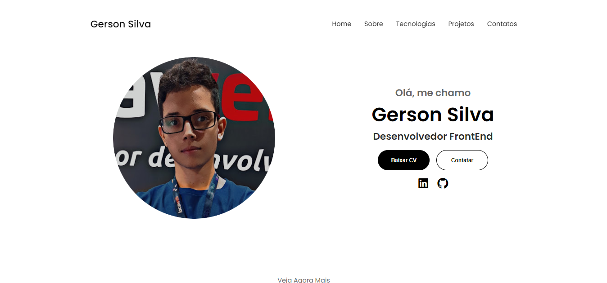

<h1 align="center"> Portfólio Responsivo </h1>

Site para atividade prática do Instituto Proa! É uma versão modificada de um tutorial de Portfólio.   Aproveitei dessa oportunidade de aprimorar meus conhecimentos e criar com HTML, CSS e Javascript meu próprio Portfólio.  

 

  

 
